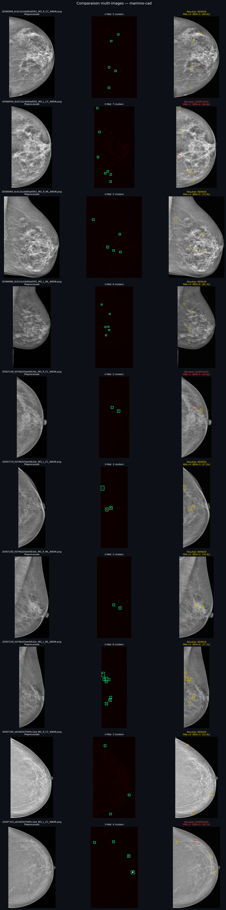
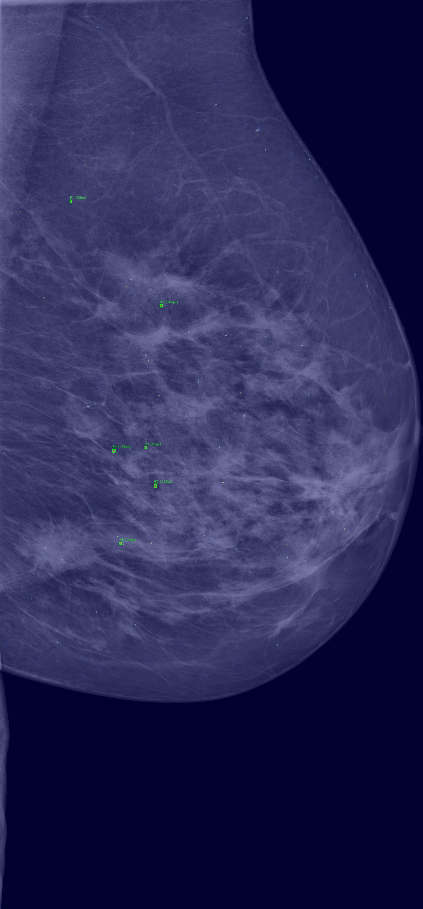
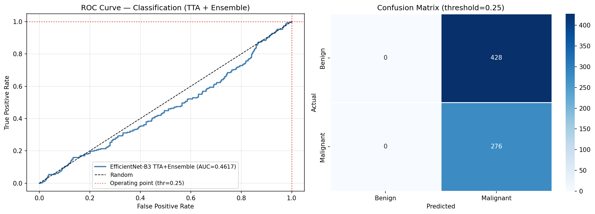
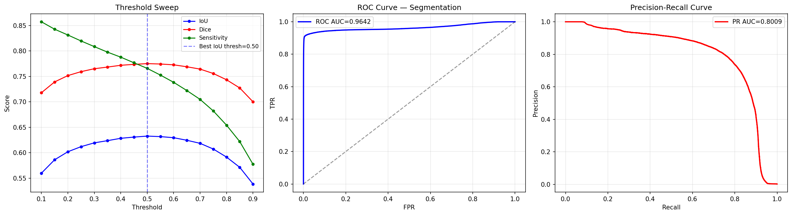
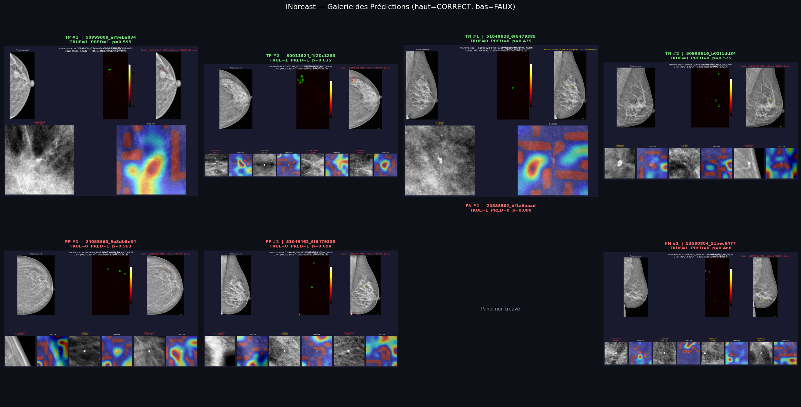

# Mammo-CAD — Mammography Computer-Aided Detection

A 2-stage deep learning pipeline for automatic microcalcification detection and malignancy classification in digital mammograms.

> **PFE — Master's thesis project, FSM / LARIS lab**  
> Supervised by M. Karim Kalti

---

## Results

| Stage | Model | Dataset | AUC-ROC | AUC-PR | Notes |
|-------|-------|---------|---------|--------|-------|
| Segmentation | U-Net (4-level) | INbreast | **0.9642** | **0.8009** | 10-fold CV, τ=0.45 |
| Classification | EfficientNet-B3 | INbreast (fine-tuned) | **0.7812** | **0.7183** | TTA-16, SWA |

---

## Pipeline Overview

```
DICOM / PNG
    ↓
Preprocessing      Flip L-facing · Artifact removal · Crop · CLAHE
    ↓
Sliding window     256×256, stride 128 → U-Net probability map
    ↓
Post-processing    Threshold τ=0.45 · Connected components · Union-Find clustering
    ↓
Classification     EfficientNet-B3 TTA-16 per candidate region
    ↓
Result             Annotated image · Grad-CAM · JSON report
```

---

## Demo

**Multi-case full pipeline output**



**Single mammogram — segmentation overlay**



**ROC & confusion matrix (classification, TTA-16)**



**Threshold sweep — ROC/PR curves**



**INbreast evaluation gallery**



---

## Architecture

### U-Net (segmentation)
- 4-level encoder–decoder, bottleneck 1024 channels
- Skip connections to preserve pixel-level detail
- Loss: weighted BCE + Dice combo
- 10-fold cross-validation, 300 epochs/fold
- Inference: sliding window 256×256, stride 128, bilinear stitching

### EfficientNet-B3 (classification)
- Compound scaling (depth × width × resolution)
- Custom head: 1536 → 256 → 1 (sigmoid)
- 2-stage training: Stage 1 (head only, 60 epochs) → Stage 2 (unfreeze blocks 5-7, 150 epochs)
- SWA on last 20 epochs → better generalization
- TTA-16: 16 augmented views averaged at inference (+0.019 AUC vs single view)
- Fine-tuned from CBIS-DDSM → INbreast: AUC 0.41 → **0.62**

### FEBDS fallback
When U-Net detects no regions, a Difference-of-Gaussians (FEBDS) detector provides candidate regions, ensuring no image leaves the pipeline without output.

---

## Installation

```bash
git clone https://github.com/Med-Amine-03/mammo-cad.git
cd mammo-cad

python -m venv venv
venv\Scripts\activate          # Windows
# source venv/bin/activate     # Linux/macOS

pip install -r requirements.txt
```

### Download model weights

Place checkpoints in `checkpoints/`:

| File | Size | Link |
|------|------|------|
| `unet_best.pth` | 237 MB | [Google Drive](https://drive.google.com/drive/folders/11byLNm1xMQ4I531XxWSm3bV39v5xN9dB?usp=sharing) |
| `efficientnet_stage2_swa.pth` | 43 MB | [Google Drive](https://drive.google.com/drive/folders/11byLNm1xMQ4I531XxWSm3bV39v5xN9dB?usp=sharing) |
| `efficientnet_inbreast_ft_swa.pth` | 43 MB | [Google Drive](https://drive.google.com/drive/folders/11byLNm1xMQ4I531XxWSm3bV39v5xN9dB?usp=sharing) |

---

## Usage

### Run the full pipeline on a single image

```bash
python -m src.inference.pipeline \
    --input path/to/mammogram.png \
    --seg-ckpt checkpoints/unet_best.pth \
    --cls-ckpt checkpoints/efficientnet_inbreast_ft_swa.pth \
    --output-dir results/
```

### Start the API backend

```bash
uvicorn api.main:app --host 0.0.0.0 --port 8000 --reload
```

Environment variables (optional):
```bash
SEG_CKPT=checkpoints/unet_best.pth
CLS_CKPT=checkpoints/efficientnet_inbreast_ft_swa.pth
RESULTS_DIR=api/results
DEVICE=cuda   # or cpu
```

### Start the frontend

```bash
cd frontend-next
npm install
npm run dev   # http://localhost:3000
```

---

## Project Structure

```
mammo-cad/
├── src/
│   ├── models/
│   │   ├── unet.py                  U-Net architecture
│   │   ├── efficientnet.py          EfficientNet-B3 + custom head
│   │   └── losses.py                BCE, Dice, combo losses
│   ├── training/
│   │   ├── train_unet.py            10-fold CV training + SWA
│   │   └── train_classifier.py      2-stage training, AdamW, MixUp
│   ├── inference/
│   │   ├── pipeline.py              End-to-end DICOM → result
│   │   ├── segment.py               U-Net sliding window inference
│   │   ├── classify.py              EfficientNet-B3 TTA-16 inference
│   │   └── explainability.py        Grad-CAM visualization
│   ├── preprocessing/
│   │   └── preprocessing.py         Flip, masking, crop, CLAHE
│   ├── dataset/
│   │   ├── seg_dataset.py           INbreast patch dataset
│   │   └── cls_dataset.py           CBIS-DDSM patch dataset
│   ├── patches/
│   │   ├── patch_extraction_seg.py  256×256 segmentation patches
│   │   └── patch_extraction_cls.py  224×224 classification patches
│   ├── inbreast/
│   │   ├── dicom_to_png.py          DICOM 16-bit → PNG conversion
│   │   ├── parse_xml_masks.py       XML annotation parser
│   │   └── build_csv.py             Metadata CSV builder
│   └── cbis_ddsm/
│       ├── build_cases.py           CBIS-DDSM case builder
│       └── extract_crops.py         Annotated crop extractor
├── api/
│   └── main.py                      FastAPI backend
├── frontend-next/
│   └── app/                         Next.js 14 web interface
├── notebooks/
│   ├── 01_explore_inbreast.ipynb    INbreast data exploration
│   ├── 02_explore_cbis.ipynb        CBIS-DDSM exploration
│   ├── 03_evaluate_seg.ipynb        Segmentation evaluation
│   ├── 04_segment_inference.ipynb   Inference visualization
│   ├── pipeline_visualization.ipynb Full pipeline demo
│   └── xai_notebook.ipynb           Explainability (Grad-CAM)
├── outputs/                         Evaluation figures & results
├── requirements.txt
└── README.md
```

---

## Datasets

| Dataset | Purpose | Size |
|---------|---------|------|
| [INbreast](https://www.kaggle.com/datasets/martholi/inbreast) | Segmentation training + fine-tuning | 313 cases, 410 DICOMs |
| [CBIS-DDSM](https://www.kaggle.com/datasets/awsaf49/cbis-ddsm-breast-cancer-image-dataset) | Classification training | 4 484 patches 224×224 |

Datasets are not included in this repository. Download links above.

---

## Training

### U-Net

```bash
python -m src.training.train_unet \
    --data-dir data/interim/inbreast \
    --output-dir checkpoints/ \
    --folds 10 \
    --epochs 300
```

### EfficientNet-B3

```bash
# Stage 1 + Stage 2 (CBIS-DDSM)
python -m src.training.train_classifier \
    --data-dir data/interim/cbis_ddsm \
    --output-dir checkpoints/ \
    --stage 1

# Fine-tune on INbreast
python scripts/finetune_inbreast.py \
    --ckpt checkpoints/efficientnet_stage2_swa.pth \
    --output-dir checkpoints/
```

---

## Web Interface

The Next.js frontend provides:
- Mammogram upload and real-time analysis
- Interactive viewer with zoom, pan, bounding boxes, and per-region tooltips
- Grad-CAM visualization per detected region
- Downloadable JSON report
- Analysis history with localStorage caching

---

## License

This project was developed as a Master's thesis (PFE) at FSM / LARIS lab.  
Medical images belong to their respective datasets — see INbreast and CBIS-DDSM licenses.
